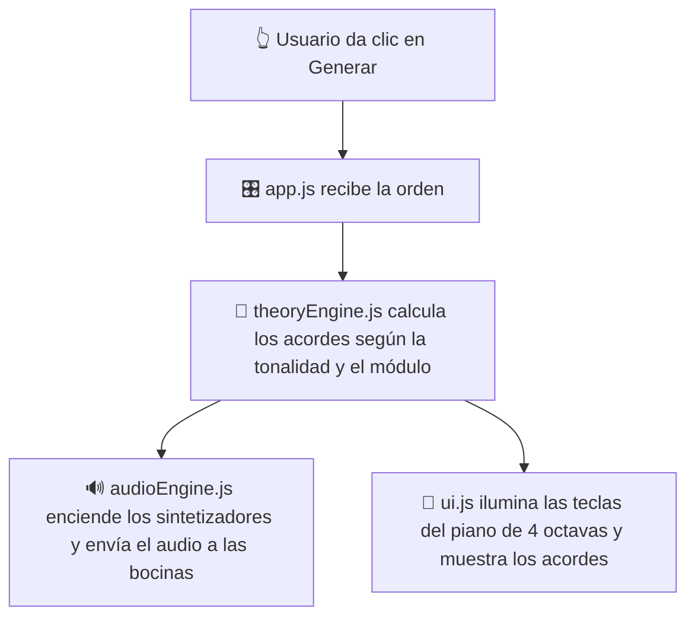

# 🚀 Explicación Técnica y Estructura Web de losfintz.com

Bienvenido a la documentación oficial de **Los Fintz Productions** ([losfintz.com](https://losfintz.com)). 

Este documento fue creado para explicar en detalle cómo está construida y programada toda la página web. Si **no sabes nada de programación**, ¡no te preocupes! Esta guía está explicada paso a paso usando analogías sencillas del mundo real.

---

## 💡 ¿Cómo funciona una página web? (La analogía de la casa)

Toda la web de **Los Fintz Productions** está construida con las tres tecnologías fundamentales de Internet (conocidas como *Vanilla Web Tech*). Imagina que construir esta sitio web fue como construir y decorar una casa:

1. **HTML (El Esqueleto y los Muros):**
   * **¿Qué hace?:** Define qué elementos hay en cada habitación (títulos, textos, imágenes, botones, listas, formularios).
   * **Archivos:** `index.html`, `mivozbrilla.html`, `harmonix.html`, `portafolio/index.html`.

2. **CSS (La Fachada, Pintura y Decoración):**
   * **¿Qué hace?:** Le da estilo visual a la estructura. Controla los colores (tonos oscuros, bordes dorados, efectos de vidrio brillante), el tipo de letra, las animaciones suaves y hace que todo se acomode automáticamente si abres la página desde un celular o desde una computadora de escritorio.
   * **Archivos:** `css/style.css`, `css/harmonix.css`.

3. **JavaScript (El Sistema Eléctrico y la Inteligencia):**
   * **¿Qué hace?:** Es el motor interactivo. Se encarga de responder a los clics del usuario, abrir/cerrar el menú en celulares, calcular acordes de música en tiempo real y sintetizar sonido directamente en los altavoces de tu dispositivo.
   * **Archivos:** `js/main.js`, `js/app.js`, `js/theoryEngine.js`, `js/audioEngine.js`, `js/ui.js`, `js/portfolio.js`.

---

## 🗺️ Mapa Completo de Archivos y Secciones del Código

A continuación se detalla qué hace cada uno de los archivos del proyecto:

```text
📁 losfintz.com (LFP2-main)
├── 📄 CNAME                  # Redirección oficial de GitHub Pages hacia el dominio losfintz.com
├── 📄 index.html             # Página Principal (Landing Page oficial)
├── 📄 mivozbrilla.html        # Página del Concurso de Canto "Mi Voz Brilla"
├── 📄 harmonix.html          # Aplicación Web: Generador Armónico Interactivo
│
├── 📁 css/                   # Estilos visuales
│   ├── 🎨 style.css          # Estilos generales del sitio (Colores, Responsive, Navegación)
│   └── 🎨 harmonix.css       # Estilos del Piano Virtual y la App Harmonix
│
├── 📁 js/                    # Inteligencia y Código Interactivo
│   ├── 🧠 main.js            # Control del menú en celulares, scroll suave y animaciones
│   ├── 🎵 theoryEngine.js    # Cerebro de Teoría Musical (Calcula escalas y progresiones)
│   ├── 🔊 audioEngine.js     # Sintetizador Digital de Audio (Genera el sonido real)
│   ├── 🎹 ui.js              # Dibujante del Piano de 4 octavas y tarjetas de acordes
│   ├── 🎛️ app.js             # Director de Orquesta (Conecta la teoría, el sonido y la pantalla)
│   └── 🖼️ portfolio.js       # Control interactivo de la galería de trabajos
│
├── 📁 portafolio/
│   └── 📄 index.html         # Sección dedicada a la galería de producciones de audio y video
│
└── 📁 images/                # Fotografías, logotipos e iconos del estudio
```

---

## 🔍 Explicación Detallada de Cada Sección

### 1. 🏠 Página Principal (`index.html` + `css/style.css`)
Es la carta de presentación de Los Fintz Productions. Está dividida en las siguientes secciones:
* **Barra de Navegación (`<nav>`):** Menú fijo superior con el logo y pestañas desplegables (incluyendo enlaces directos a las funciones de Harmonix).
* **Portada / Hero Section (`<header>`):** Encabezado con título llamativo, texto de bienvenida y botón de llamado a la acción ("Pedir Cotización").
* **Sobre el Estudio (`#about`):** Descripción del home-studio y el equipamiento (DJI, VideoBolt, CD Baby).
* **Servicios (`#services`):** Tarjetas informativas sobre Video Lyrics, Mezcla de Audio, Grabación con Drone y Distribución Musical.
* **Portafolio Destacado (`#portfolio`):** Galería con imágenes y enlaces a los trabajos recientes.
* **Proceso de Trabajo (`#process`):** Explicación paso a paso de cómo se trabaja con el estudio.
* **Contacto y Footer (`#contact` / `<footer>`):** Información de WhatsApp, email institucional (`cesar@losfintz.com`) y redes sociales.

---

### 2. 🎤 Concurso de Canto ("Mi Voz Brilla" - `mivozbrilla.html`)
Página especial con diseño exclusivo en **tonos dorados y negros elegantes**:
* Muestra el logotipo del concurso en alta resolución.
* Incluye un botón directo para enviar audios/videos por **WhatsApp**.
* Presenta las bases del concurso organizadas en tarjetas visuales: ¿Quién puede participar?, Categorías (Pop, Rock, Jazz, Mariachi, etc.), Requisitos del video, Fechas límites y Premios.

---

### 3. 🎹 Generador Armónico Interactivo ("Harmonix LFP" - `harmonix.html`)
Es una **aplicación musical completa integrada en la página web**. Permite a compositores y músicos generar progresiones de acordes y escucharlas en tiempo real. 

Funciona mediante la colaboración de **4 scripts de JavaScript**:

#### A) `js/theoryEngine.js` (El Cerebro Musical)
* Contiene el conocimiento matemático y teórico de la música.
* Sabe qué notas componen cada escala musical (Mayor, Menor) en cualquier tonalidad (Do, Re, Mi, Fa, Sol, La, Si y sus alterados).
* **10 Módulos de Generación Musical:**
  1. *Pop / Básicas* (Progresiones de 4 acordes populares).
  2. *Clásicas / Cadencias* (Movimientos armónicos tradicionales).
  3. *Jazz / Sustituciones* (Acordes de 7ma y tensiones).
  4. *Prog Rock / Arcos* (Cambios épicos de tonalidad).
  5. *Canción Completa* (Estructuras de 16 acordes: Verso - Coro - Puente).
  6. *Blues / R&B* (Estructuras de 12 compases con acordes dominantes).
  7. *Bossa Nova / Latin Jazz* (Ritmos armónicos sudamericanos).
  8. *Flamenco / Español* (Modo frigio y cadencias andaluzas).
  9. *Ambient / Cinemático* (Texturas armónicas abiertas).
  10. *Neo-Soul / Gospel* (Acordes enriquecidos con 9nas y 11nas).

#### B) `js/audioEngine.js` (El Sintetizador Virtual - Web Audio API)
* **¡No requiere archivos de audio grabados (MP3/WAV)!** El navegador genera las ondas sonoras en tiempo real usando matemáticas.
* Crea osciladores de sonido (ondas de piano/sintetizador) y aplica una envolvente acústica **ADSR** (Ataque, Decaimiento, Sostenimiento y Relajación) para que suene natural.
* Permite ajustar la velocidad de reproducción (**BPM**), el volumen máster y activar un modo **50% de velocidad (Slow Motion)** para practicar lento.

#### C) `js/ui.js` (La Interfaz del Piano y Acordes)
* Dibuja dinámicamente en pantalla un **piano de 4 octavas completo** (teclas blancas y negras).
* Cuando la música suena, **enciende y resalta en amarillo las teclas exactas** que componen el acorde seleccionado.
* Dibuja las tarjetas visuales de los acordes con su cifrado armónico.

#### D) `js/app.js` (El Director de Orquesta)
* Escucha cuando el usuario presiona los botones de "Generar", "Reproducir", "Pausar" o cambia de pestaña.
* Le pide a `theoryEngine` los acordes, le dice a `audioEngine` que los toque y le ordena a `ui` que los dibuje en la pantalla al mismo tiempo.

---

### 4.📱 Menú Responsive y Comportamiento (`js/main.js`)
* Detecta si el usuario está visitando la página desde un teléfono celular.
* Convierte la barra de navegación en un **menú hamburguesa** desplegable (`☰` se transforma en `✕`).
* Permite navegar con desplazamiento suave (*smooth scrolling*) entre las distintas secciones.

---

## ⚡ ¿Cómo interactúan todas las piezas juntas? (Ejemplo práctico)

Imagina qué sucede tras bambalinas cuando estás en la página de **Harmonix** y das clic en **"Generar Progresión"**:



1. **Tu clic** en la pantalla es recibido por `app.js`.
2. `app.js` le pregunta a `theoryEngine.js`: *"Calcula una progresión en Re Menor usando el Módulo de Jazz"*.
3. `theoryEngine.js` calcula las frecuencias exactas en Hertz (Hz) de cada nota.
4. `audioEngine.js` hace sonar esas frecuencias a través de las bocinas de tu celular o computadora.
5. `ui.js` enciende las teclas en el piano virtual para que veas exactamente cómo se toca el acorde.

---

## 🛠️ Tecnologías y Ventajas del Proyecto

* **Sin librerías pesadas:** Toda la página carga en una fracción de segundo porque no usa frameworks lentos ni dependencias pesadas.
* **100% Responsiva:** Adaptada para celulares Android/iOS, tablets, laptops y monitores 4K.
* **Alojamiento Gratuito y de Alta Velocidad:** Hospedada directamente en GitHub Pages apuntando al dominio personalizado `losfintz.com` mediante el archivo `CNAME`.
* **Iconos Vectoriales:** Utiliza la librería moderna de iconos `Lucide` para gráficos nítidos.

---

## 📝 Resumen

Todo el proyecto fue desarrollado íntegramente con **Antigravity AI**, estructurando un diseño limpio, profesional y accesible tanto para artistas independientes como para entusiastas de la música. ¡Disfruta navegando y creando música en [losfintz.com](https://losfintz.com)!
